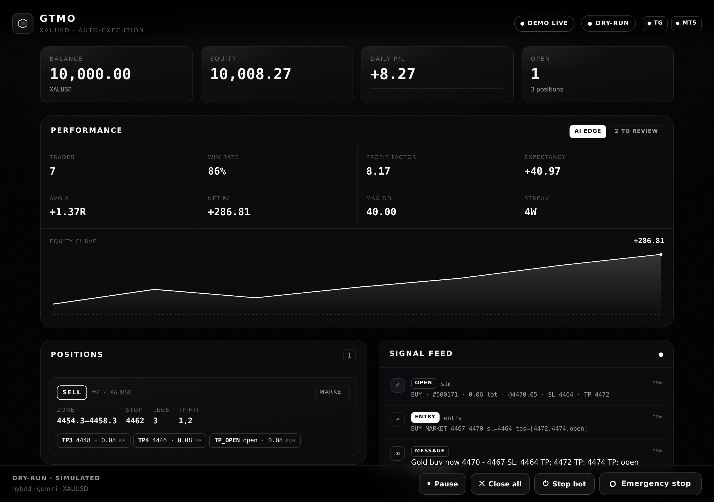
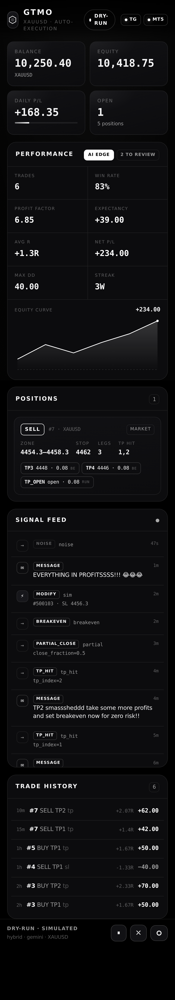

# GTMO VIP — XAUUSD Telegram → MT5 Auto-Trading Bot

A high-performance, production-grade automated trading bot that listens 24/7 to
the **GTMO VIP** Telegram channel, intelligently parses Gold (XAUUSD) signals
and follow-up management instructions, and executes them on **MetaTrader 5**
with minimal latency.

> ⚠️ **Trading risk.** This software places real orders when `DRY_RUN=false`.
> Trading leveraged Gold is extremely risky. Use at your own risk, start in
> dry-run, test on a demo account, and never risk money you can't afford to
> lose. Copying signals from a third-party channel is **not** financial advice.

---

## 📸 Dashboard

Minimal, high-end, black-and-white, mobile-first. Live metrics, equity curve,
positions, signal feed, trade history, and one-tap controls.

| Desktop | Mobile |
|---|---|
|  |  |

Generate fresh screenshots any time (no API keys needed):
```bash
python scripts/screenshot.py        # → docs/screenshots/*.png
```

---

## ✨ What it does

It reads messages like the ones GTMO VIP posts and turns them into actions:

| Channel message | Parsed intent | MT5 action |
|---|---|---|
| `Gold buy now 4470 - 4467` / `SL: 4464` / `TP: 4472 … TP: open (100+ pips)` | **ENTRY** (BUY, zone, SL, 4 TPs + runner) | Open one position per TP, shared SL, risk-sized |
| `Adjust SL to 4462` | **MODIFY_SL** | Move SL on every open leg |
| `Breakeven set for zero risk on all entries` | **BREAKEVEN** | Move SL → entry on all signals |
| `Take some profits` | **PARTIAL_CLOSE** | Close 50% of each leg |
| `TP2 smasssheddd take some more profits and set breakeven now` | **TP_HIT + PARTIAL_CLOSE + BREAKEVEN** | Reconcile, partial close, breakeven |
| `TP1 has been touched` / `TP2 checkkk 70+ pips` | **TP_HIT** | Reconcile state with broker |
| Motivation / charts / disclaimers | **NOISE** | Ignored |

---

## 🏗️ Architecture

```
Telegram (Telethon, asyncio)
        │  raw message
        ▼
   Parser  ──► regex (instant)  ──┐
   (mode)     AI: Gemini/Claude ──┤──► [Intent, Intent, …]
              hybrid (regex→AI)  ──┘
        │
        ▼
     Trader  ── risk sizing & validation ──► State (per-signal magic #)
        │
        ▼
   MT5 Executor  ── dedicated worker thread (terminal isn't thread-safe)
        │
        ▼
   MetaTrader 5  (or built-in Simulator in dry-run / on Linux)
```

Every layer is asyncio-native. The only blocking dependency — the MT5 terminal —
is isolated behind a single dedicated worker thread, so the Telegram listener is
never stalled.

```
bot/
├── app.py              # orchestrator (wires everything, lifecycle, signals)
├── config.py           # env-driven, validated configuration
├── logger.py           # rotating logs + structured JSONL audit trail
├── models.py           # Intent / EntrySignal / TakeProfit dataclasses
├── trader.py           # Intent → MT5 action dispatcher
├── parser/
│   ├── patterns.py     # regex building blocks (edit here to add phrasings)
│   ├── signal_parser.py# fast deterministic parser (compound-aware)
│   ├── ai_parser.py    # Claude (Anthropic) parser via tool-use
│   ├── gemini_parser.py# Gemini parser via JSON mode (fastest)
│   ├── intent_builder.py # shared LLM-JSON → Intent mapping + system prompt
│   └── hybrid.py       # build_parser() factory + hybrid strategy
├── telegram/listener.py# Telethon listener with robust auto-reconnect
├── mt5/executor.py     # MT5 execution + in-memory simulator
├── risk/manager.py     # sizing, daily-loss halt, adaptive throttle, validation
├── state/manager.py    # active signals/positions, JSON persistence
├── analytics/          # trade journal + performance metrics (win rate, PF, R…)
└── intelligence/       # signal scorer + parser self-learning review queue
web/
├── server.py           # FastAPI dashboard backend (REST + WebSocket)
├── demo.py             # seed sample data for a UI preview
└── static/             # black & white, mobile-first SPA (html/css/js)
main.py                 # entry point + offline `--parse` / `--web` tools
tests/                  # parser + end-to-end pipeline tests
```

---

## 🧠 Parsing: AI, regex, or hybrid

Because the channel doesn't guarantee a fixed format, you can choose how messages
are interpreted via `PARSER_MODE`:

- **`hybrid`** *(default, recommended)* — regex runs first (sub-millisecond) and
  handles the well-known GTMO formats instantly; the LLM is consulted **only**
  when regex is unsure (returned pure noise / low confidence while the text still
  looks trade-related). Best balance of **speed** and **robustness**.
- **`ai`** — every message goes to the LLM. Most robust to brand-new phrasings,
  typos and reordering, at the cost of a network round-trip per message.
- **`regex`** — deterministic, zero network latency, no API key required.

**Multi-symbol:** the parser detects the instrument from the message (Gold/XAUUSD
by default, plus EURUSD, GBPUSD, USDJPY, XAGUSD, US30, NAS100, US500, BTCUSD) and
tags each signal. Set `SYMBOLS` to the comma-separated list you allow; entries on
other instruments are skipped. Price plausibility is symbol-aware (FX decimals vs.
gold). Extend the table in `bot/parser/patterns.py`.

**AI provider** (`AI_PROVIDER`): `gemini` *(default — Gemini Flash is typically
the fastest)* or `anthropic` (Claude Haiku). The LLM returns a strict,
schema-validated list of intents, so its output is constrained to the exact
structure the executor understands.

> 💡 **On speed:** pure `ai` mode adds the model's latency (a few hundred ms with
> Gemini Flash) to *every* message. For the fastest possible execution on the
> common signal formats while still covering the long tail, keep `hybrid`.

Add new phrasings by editing `bot/parser/patterns.py` (regex) — no control-flow
changes needed — or simply rely on the AI parser to generalise.

---

## 🚀 Setup

### 1. Telegram API credentials
Create an app at <https://my.telegram.org> → *API development tools* to get your
`api_id` and `api_hash`. The bot logs in as **your user account** (so it can read
the channel you're a member of).

### 2. Configure
```bash
cp .env.example .env
# edit .env: Telegram creds + channel, AI key, MT5 login, risk settings
```
Set `TELEGRAM_CHANNEL` to the numeric id (`-100…`), `@username`, or the exact
title `GTMO VIP`.

### 3. Install
```bash
python -m venv .venv && source .venv/bin/activate
pip install -r requirements.txt
```
- `MetaTrader5` installs only on **Windows** (platform marker). On Linux/macOS or
  in dry-run, the bot uses a built-in **simulator** automatically.
- The AI SDKs (`google-genai`, `anthropic`) are optional — only the one matching
  `AI_PROVIDER` is needed. If missing, the bot falls back to regex parsing.

### 4. First-time Telegram login
```bash
python main.py
```
You'll be prompted for the phone code (and 2FA password if enabled). A
`*.session` file is created so subsequent runs log in automatically.

### 5. Test parsing offline (no MT5/Telegram needed)
```bash
python main.py --parse "Gold buy now 4470 - 4467\nSL: 4464\nTP: 4472\nTP: open (100+ pips)"
python main.py --parse "TP2 smashed take some more profits and set breakeven now"
```

### 6. Replay real channel history (read-only — best way to validate)
Instead of forwarding messages anywhere, point the bot at the channel and let it
**replay the last few days of real history** through the parser. It places **no
trades** — it just shows how every message is interpreted:
```bash
python main.py --backfill 3              # last 3 days
python main.py --backfill 7 --show-noise # include ignored messages
```
Example output:
```
[06-04 13:00] #4821   Gold sell now 4454.3 - 4458.3 ⏎ SL: 4462 ⏎ TP: 4452 …
            └─► ENTRY SELL MARKET 4454.3-4458.3 SL=4462.0 TP=[4452, 4450, …, open]
[06-04 13:31] #4839   TP2 smasssheddd take some more profits and set breakeven…
            └─► TP_HIT (tp=2)
            └─► PARTIAL_CLOSE (partial, 50%)
            └─► BREAKEVEN
============================================================
Scanned 142 message(s); 17 actionable.
```
This is the recommended way to tune `PARSER_MODE`/patterns against the channel's
real wording before going live.

### Preflight check
```bash
python main.py --doctor      # validates config, MT5, parser & API keys
```

### Backtest on history
Replay real messages against price history to validate the edge (same parsing
and management logic as live; results in risk units / R-multiples):
```bash
python main.py --backtest messages.jsonl prices.csv
```
`messages.jsonl` is one `{"ts": <unix>, "text": "..."}` per line (or a Telegram
Desktop export `.json`); `prices.csv` has columns `ts,high,low,close` (or
`ts,price`). Prints win rate, profit factor, expectancy, avg R and max drawdown.

---

## 🖥️ Dashboard

A clean, minimal, **black-and-white, mobile-first** web dashboard to monitor and
control the bot in real time.

```bash
python main.py --web                 # http://127.0.0.1:8000
python main.py --web --demo          # seed sample data and preview the UI
python main.py --web --host 0.0.0.0 --port 8080
```

It shows live **balance / equity / daily P&L / open exposure**, the **active
positions** (per-signal legs, SL, TP, breakeven flags), a **live signal feed**
(every message → parsed intent → MT5 action), a **Performance panel with an
equity-curve chart**, and a **trade-history table**. Controls include one-tap
**Emergency Stop**, **Pause/Resume** (block new entries) and **Close-all**.
Updates stream over a WebSocket.

**Auth:** set `DASHBOARD_TOKEN` to require a token (login screen + bearer auth on
the API/WebSocket). Strongly recommended if the dashboard is reachable beyond
localhost — it can halt trading and flatten positions.

The dashboard is fully **decoupled** from the trading process — it reads the
bot's `state/`+`logs/` artifacts and writes the emergency-stop file — so it can
run in the same or a separate process, and the bot keeps a `state/status.json`
heartbeat for it. Built with FastAPI + vanilla JS (no build step).

> Tip: run the bot (`python main.py`) and the dashboard (`python main.py --web`)
> as two processes pointed at the same `LOG_DIR`/`STATE_FILE`.

---

## 🧠 Intelligence & evolution

> **Honest framing first.** No system can "know" the market or guarantee profit —
> anything that claims to is dangerous. What makes a system *intelligent* is that
> it **measures every outcome, learns from it, and adapts** with hard guardrails.
> These layers improve discipline and consistency; they do not predict price.

Four layers, all on by default and individually configurable:

**1. Performance analytics** (`bot/analytics/`) — every closed trade is journaled
to `state/trades.jsonl` with its realized P&L and **R-multiple** (profit in units
of risk). From this the bot computes win rate, **profit factor**, expectancy,
average R, **max drawdown** and current streak — surfaced live on the dashboard.
You can't improve what you don't measure.

**2. Signal scoring & filter** (`bot/intelligence/scorer.py`) — before risking a
cent, each entry gets a transparent 0–1 quality score:
- stop-loss present? (no SL is penalised or skipped)
- **risk:reward** of the nearest TP vs. the SL distance
- **not chasing** — skip if price already ran past the entry toward target
- **recent edge** — nudged by the journal's win rate / profit factor

Weak setups are **skipped**; mediocre ones are **downsized**. Every decision is
logged with human-readable reasons (`signal_score` audit events).

**3. Adaptive risk** (`bot/risk/manager.py`) — a bounded throttle that **shrinks
position size after a losing streak or while in drawdown**, and restores toward
full size as results recover. Combined with daily-loss protection, this enforces
"slow down when it's not working."

**4. Parser self-learning queue** (`bot/intelligence/review.py`) — the parser is
never "done." Messages it was unsure about (low confidence, or where regex and AI
disagree) are appended to `state/review_queue.jsonl` instead of being silently
dropped — a queue you skim to add a new pattern or test case. This is how the
parser **evolves** with the channel.

Together these form a feedback loop: **outcome → measurement → scoring/throttle →
adapted next action.** Tune everything via the `INTEL_*` / `*_RISK` settings in
`.env`, or disable with `INTEL_ENABLED=false`.

---

## 🛡️ Risk management

- **`RISK_PER_SIGNAL`** — fraction of equity risked across the *whole* signal
  (split evenly across the positions opened, one per take-profit). Lot sizes are
  derived from the SL distance using the symbol's tick value.
- **`MAX_DAILY_LOSS`** — once realised losses exceed this fraction of start-of-day
  balance, **new entries are halted** for the day.
- **`MAX_OPEN_SIGNALS`**, **`MAX_LOT`/`MIN_LOT`** — hard caps.
- **Validation** — entries are rejected if the SL is on the wrong side of the
  entry, the price is implausible, or limits are exceeded.
- **Emergency stop** — create the file named by `EMERGENCY_STOP_FILE`
  (default `.EMERGENCY_STOP`) and **no new trades** are placed:
  ```bash
  touch .EMERGENCY_STOP   # halt    │    rm .EMERGENCY_STOP   # resume
  ```

---

## 📊 Logging & audit

- `logs/bot.log` — rotating human-readable log (everything at DEBUG to file).
- `logs/audit.jsonl` — one JSON line per **received message**, **parsed intent**
  and **MT5 action** (including latency and, for AI, token usage). Ideal for
  post-mortems and reconciling against your broker.

---

## 🐳 Docker

```bash
docker compose up --build -d        # build & run detached
docker compose logs -f              # follow logs
```
The container runs the listener + parser + **simulator** (dry-run) on Linux.
Telethon session, `logs/` and `state/` are persisted via volumes.

**Live trading needs MT5**, which is Windows-only. Options:
1. Run the bot directly on a **Windows VPS** with the MT5 terminal installed
   (recommended for lowest latency), or
2. Run MT5 under **Wine** with a bridge, or run the terminal on Windows and the
   bot elsewhere pointing at it.

---

## 🔢 How an entry is executed

For `Gold buy now 4470 - 4467 / SL 4464 / TP 4472,4474,4476,4478 / TP open`:

1. A unique **magic number** is assigned to the signal (`MT5_MAGIC_BASE + id`).
2. With `ONE_POSITION_PER_TP=true`, **5 positions** are opened (4 fixed TPs + 1
   open runner), each tagged `GTMO#<id>-TP<n>`, all sharing SL `4464`.
3. `RISK_PER_SIGNAL` is split evenly across the legs; each lot is sized from the
   SL distance and clamped to broker volume limits.
4. `MARKET` orders ("now") fill immediately; `LIMIT`/`STOP` orders are spread
   across the entry zone.
5. Follow-ups (`Adjust SL`, `Breakeven`, `Take profits`) target the most recent
   signal — or **all** active signals when the message says "on all entries".
6. When the broker closes a leg at its TP, `TP_HIT` messages trigger a
   reconciliation that syncs local state with the terminal.

---

## ⚙️ Configuration reference

See [`.env.example`](.env.example) for every setting with inline docs. Key ones:

| Variable | Default | Meaning |
|---|---|---|
| `PARSER_MODE` | `hybrid` | `regex` \| `ai` \| `hybrid` |
| `AI_PROVIDER` | `gemini` | `gemini` \| `anthropic` |
| `DRY_RUN` | `true` | Simulate orders (no real trades) — **keep true until verified** |
| `RISK_PER_SIGNAL` | `0.01` | 1% of equity per signal |
| `MAX_DAILY_LOSS` | `0.05` | Halt after 5% daily loss |
| `ONE_POSITION_PER_TP` | `true` | One position per TP vs. a single position |
| `PIP_SIZE` | `0.1` | XAUUSD pip in price (70 pips ≈ 7.0) |

---

## 🧪 Tests

```bash
pytest -q                 # 92 tests: parser, execution, intelligence, multi-
                          # symbol, backtest, dashboard, AI parsers, e2e, and
                          # LIVE MT5 + Telegram paths (via faithful SDK mocks)
python scripts/smoke.py   # human-readable end-to-end demo (no API keys)
python scripts/live_check.py   # real Telegram + MT5 check (needs your keys)
```
Highlights: `test_parser` pins behaviour to the exact GTMO screenshot styles;
`test_end_to_end` runs a full simulated session; `test_ai_parser` injects fake
Gemini/Anthropic clients to prove the AI paths map responses to intents
correctly — **so the moment you add a real key, parsing works**; `test_dashboard`
covers every API route + token auth.

### Going live with your keys — step by step
Everything runs key-free in simulation. To connect the real services with
confidence, follow this order:

1. **Configure** — `cp .env.example .env` and fill in Telegram (`TELEGRAM_API_ID/
   HASH/CHANNEL/PHONE`), MT5 (`MT5_LOGIN/PASSWORD/SERVER`), and optionally
   `GEMINI_API_KEY` + `PARSER_MODE=hybrid`. No AI key → automatic regex fallback.
2. **First Telegram login** — `python main.py` once; enter the phone code (and
   2FA). This creates the `.session` file so future runs are non-interactive.
   (Run MT5 on a **Windows host/VPS** — the `MetaTrader5` package is Windows-only.)
3. **Preflight** — `python main.py --doctor` checks config, AI key, the **real
   Telegram connection** (via the session) and the **real MT5 connection**
   (symbol + balance). Everything should be PASS.
4. **Live connectivity check** — `python scripts/live_check.py` connects for real
   and proves the full chain: a live AI parse, reads your channel's last messages
   and shows how each parses, and **validates a 0.01-lot order via `order_check`
   without placing it** (zero risk). Add `--trade` to place & immediately close a
   real 0.01-lot order on a **demo** account for a true round-trip.
5. **Go live** — keep `DRY_RUN=true` on a demo first; flip to `false` only once
   `--doctor`, `--live-check`, and the Performance panel all look right.

> The bot calls the real `MetaTrader5` and `telethon` APIs directly; the request
> shapes (order_send/login/history) and the listen→parse→execute flow are covered
> by 90+ tests against faithful SDK mocks, so the code paths are verified — and
> `--live-check` confirms your specific credentials and broker work end-to-end.

---

## 🧯 Disclaimer

This project is provided for educational purposes. It automates copying of a
third-party signal channel and is not financial advice. Markets are risky;
leveraged Gold especially so. You are solely responsible for any trades placed.
